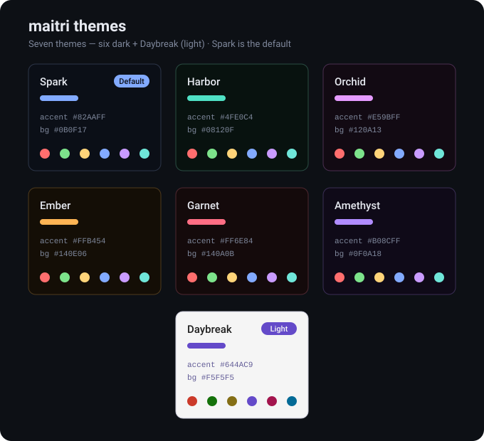

# maitri

**maitri** (pronounced *MY-tree*) is a beautiful, opinionated Linux desktop made by
[Kindness](https://kindness.ai). It turns a fresh [Arch Linux](https://archlinux.org) install into a
fully configured, Hyprland-based desktop with sane defaults and a curated set of apps.

*Maitrī* is a Sanskrit word for loving-kindness — unconditional friendliness and goodwill. That's the
feeling we're after: a calmer, kinder computer.

maitri is a friendly fork of [Omarchy](https://omarchy.org) by DHH. The Hyprland config, the Quickshell <!-- rebrand:keep -->
desktop, the theming engine and the package-backed update machinery all come from there, and we owe
that project an enormous thanks. maitri tracks Omarchy releases and layers its own identity on top: <!-- rebrand:keep -->
the Vicinae launcher, fish, Helium, VS Code, maitri's themes and the `[maitri]` package channel.

## Install

maitri installs from its ISO. Download the latest one from the
[Releases](https://github.com/kindness-ai/maitri/releases) page, write it to a USB stick, boot, and
follow the guided installer. The ISO carries every package it needs, so the install works offline.

See [iso/README.md](iso/README.md) for building the ISO yourself.

## Updating

maitri is package-backed: the desktop lives in the `maitri` and `maitri-settings` pacman packages,
served from the `[maitri]` repository alongside the official Arch mirrors.

- **`maitri update`** — takes a snapshot, upgrades every package, runs pending migrations, and
  restarts what needs restarting. Safe to run anytime.
- **`maitri channel set stable|edge|dev`** — `edge` follows maitri's `main` branch through the
  `maitri-dev` packages; `dev` links the runtime to a git checkout.

Your `/home` is snapshotted hourly on its own Snapper timeline, separate from the root snapshots, so
a botched config edit is recoverable: browse `/home/.snapshots/<N>/snapshot/` or use
`sudo snapper -c home undochange <N>..0 <path>`.

## Themes

maitri ships seven themes — six dark plus **Daybreak** (light) — with a shared vivid palette. **Spark**
(deep blue) is the default; switch any time with `Super + Ctrl + Shift + Space`.

## What's inside

- **Desktop** — Hyprland (Wayland), the Quickshell-based maitri shell for the bar, notifications,
  lock screen and panels, the Vicinae launcher and maitri menu, SDDM login, Plymouth boot splash.
- **Defaults** — fish shell, Helium browser, VS Code editor, foot terminal.
- **Apps** — a curated set of GUI, CLI, web apps and AI tooling. See [APPS.md](APPS.md).

## The maitri manual

The chapters under [`manual/`](manual/) are adapted from the Omarchy manual and describe the <!-- rebrand:keep -->
desktop in depth; where maitri differs (launcher, shell, browser, editor) this README and
[APPS.md](APPS.md) are authoritative.

## Hacking on maitri

[maitri.md](maitri.md) explains how the project is built, released and kept in sync with Omarchy. <!-- rebrand:keep -->
[AGENTS.md](AGENTS.md) carries the contributor conventions.

## License

MIT — like Omarchy, the project maitri grew from. <!-- rebrand:keep -->
